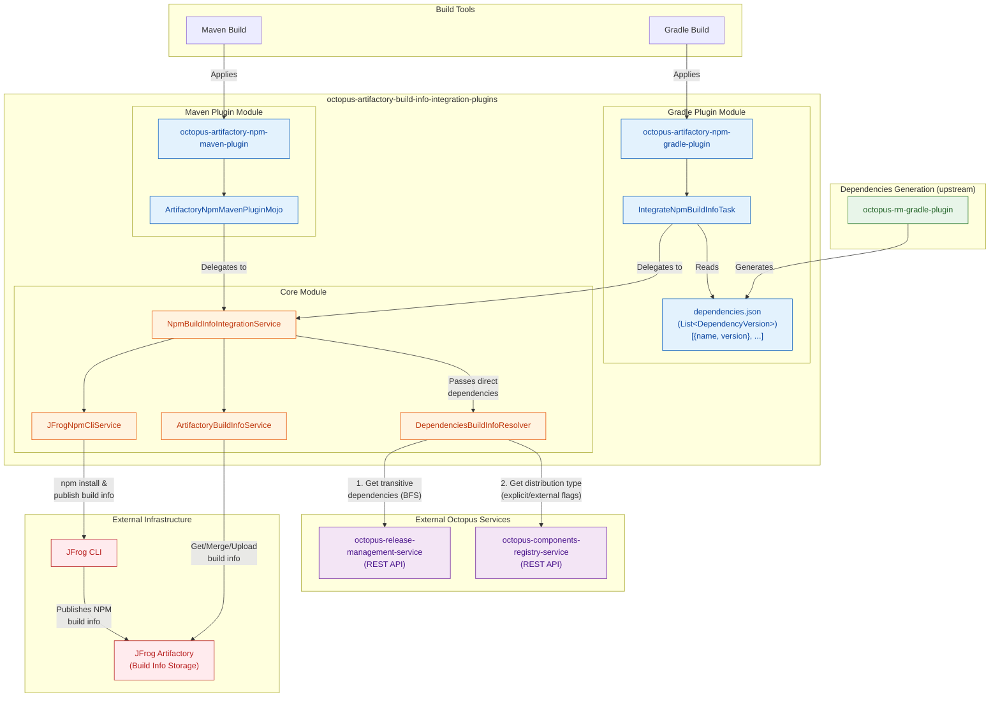

# Architecture & Ecosystem Diagram

This document describes how `octopus-artifactory-build-info-integration-plugins` relates to other Octopus projects in the ecosystem.

## High-Level Architecture



## Build Name Calculation

The `DependenciesBuildInfoResolver` calculates the Artifactory build name for each dependency using the component's distribution type from the Components Registry:

```
Build Name Format: {component}_{explicitFlag}{externalFlag}

Where:
  - explicitFlag = "e" if distribution.explicit == true, else "i"
  - externalFlag = "e" if distribution.external == true, else "i"

Examples:
  - "my-component_ii" → implicit distribution, internal
  - "my-component_ei" → explicit distribution, internal
  - "my-component_ee" → explicit distribution, external
```

